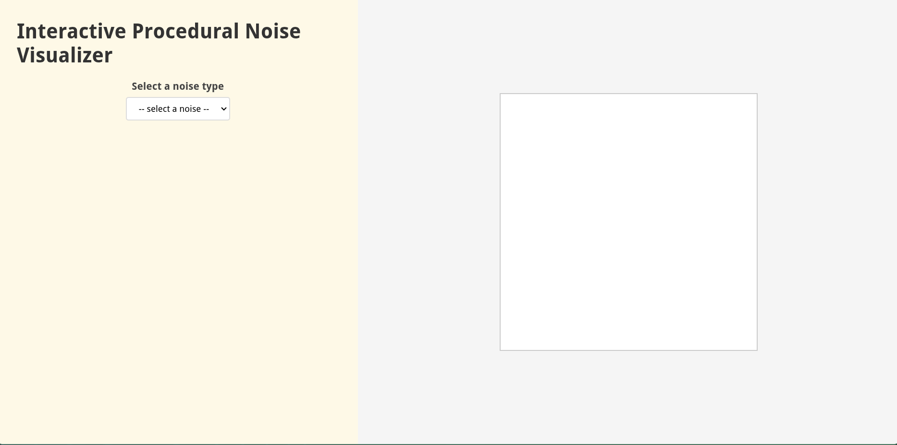
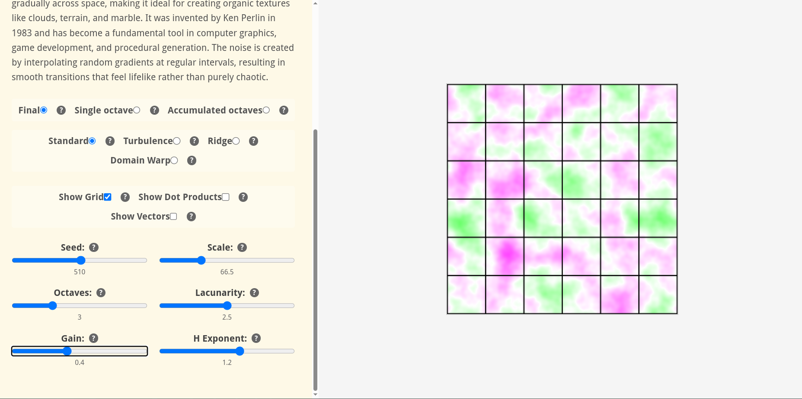
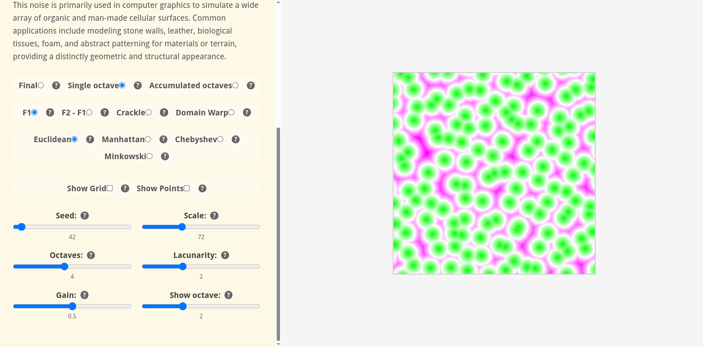

# seeing_noise
### Interactive Procedural Noise Visualizer

Seeing Noise is an immersive, educational tool that brings the abstract mathematics of procedural noise to life. Inspired by Brown University's interactive probability theory course, this project allows you to visually experiment with and understand the fundamental building blocks of computer graphics, simulation, and generative art.

## Features
Comprehensive Noise Library
- Perlin Noise - The classic gradient noise that started it all
- Simplex Noise - Perlin's more efficient, higher-quality successor
- Wavelet Noise - Multi-resolution noise with excellent spectral control
- Gabor Noise - Psychologically-inspired noise that mimics natural textures
- Anisotropic Noise - Directionally-controlled patterns for organic flows
- Worley Noise (Cellular) - Voronoi-based patterns perfect for organic structures

## Advanced Noise Variants
Each noise type comes with multiple fractional Brownian motion (fBm) configurations. Some of them are:
- Standard fBm with customizable octaves and lacunarity
- Ridge noise for mountainous terrain effects
- Domain warp for trippy, but cool looking noises
  
## Interactive Learning Experience
- Real-time parameter adjustment with instant visual feedback
- Educational tooltips explaining every parameter and concept

## Running
You can access latest version of visualizer through Github Pages
[https://paululanovskij.github.io/seeing_noise/](https://paululanovskij.github.io/seeing_noise/)

If you want to run visualizer locally:
You can download latest build of visualizer fromm Releases section.
After you have downloaded and unpacked archive, just serve it via any http server of your liking.

If you have Python installed just invoke `python -m http.server` in unpacked directory and visit [http://localhost:8000](http://localhost:8000)

## Building from source
To build visualizer from source you will need:
- Rust
- wasm-pack (which can be installed through `cargo install wasm-pack`)

Just clone the repo and run `make build`

## Screenshots

  
  
  

## Educational Value
Seeing Noise is designed to help you understand:
- How different noise algorithms create distinct visual patterns
- The practical effects of parameters like persistence, lacunarity, and octaves
- Get a feel for what noise type your project needs

## License
This project is licensed under the MIT License - see the LICENSE.md file for details.

## Acknowledgments
- Brown University for the inspirational interactive probability course
- The computer graphics community for continuous innovation in procedural generation
